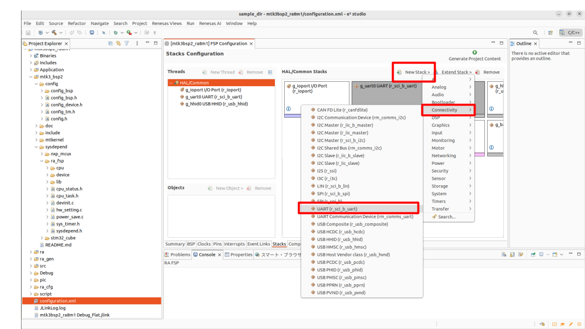

# mtk3_programming_contest

## 目次

1. [使用するデバイス等](#使用するデバイス等)
2. [回路図](#回路図)
3. [configuration.xmlから各種設定](#1.configuration.xmlから各種設定)
4. [デバイスドライバの実装](#2.デバイスドライバの実装)
5. [デバイスドライバをコンパイル対象にして組み込む](#3.デバイスドライバをコンパイル対象にして組み込む)
6. [app_main.cからデバイスを操作する。](#4.app_main.cからデバイスを操作する。)
7. [今回作成したプログラム](#5.今回作成したプログラム)


## 使用するデバイス等
### ボード
|Board| MCU | IDE | Manufacturer |
|-|-|-|-|
| EK-RA8M1      | RA8M1       | e2studio      |Renesas            |

### Bluetooth module
|デバイス|リンク|
|:-:|:-:|
|REYAX RYB080I_lite|https://www.m2mcraft.co.jp/reyax.html|


### 作成物と通信を行うデバイス
bluetoothを使えるデバイス
Android スマホであれば、Serial Bluetooth Teminalで対応可能

## 回路図

下記に参考にした回路を示す。この回路からBluetoothモジュールの接続のみ利用した。実際にBluetoothモジュールのRXには抵抗をはさんだ上でrenesasマイコンのTXへ、モジュールのTXにはrenesasマイコンのRXへ直接接続した。LEDについては、今回使用したEK-RA8M1には標準で3津搭載されているのでそれらを使用した。


(refer from https://how2electronics.com/reyax-ryb080i-bluetooth-module-with-arduino/)

# device-driver 追加方法
1．configuration.xmlから各種設定
    1-1. 使用したい通信規格をstack tabから追加する。
    1-2. 使用したい通信規格等をGPIOに割り当てる。例：UART
    1-3. clockの設定
    1-4. baudrateやstopbit等を設定する
2. デバイスドライバの実装
3. デバイスドライバをコンパイル対象に、組み込む
    3-1. \${BASE_DIR}/mtk3_bsp2/sysdepend/\${VENDOR}/device/ 下位にデバイスドライバ配置する
    3-2. 
4. app_main.cからデバイスを操作する。


## 1.configuration.xmlから各種設定
ここでは、UARTを追加する例を示す。

1. stackにアイテムを追加
ConectivityからUART(r_scib_uart)を選択する。




2. GPIOへの割当
Peripherals/Conectivity;SCI/SCI0のoperation modeをUARTにする。


3. clockの設定
設定に不都合があれば、赤文字になるのでそれに合わせて修正


4. 通信規格の設定
UARTの場合、BaudrateやParity、stop bitを設定
このときの値は、[REYAX RYB080I_lite](https://www.m2mcraft.co.jp/reyax.html)を参照する。


## 2.デバイスドライバの実装

### 2.1 デバイスドライバの置き場
各社が提供するHAL(Hardware Abstract Layer)を使用する場合は、
> \${BASE_DIR}/mtk3_bsp2/sysdepend/\${VENDOR}/device/

下位に配置する。本レポジトリでは、UARTを扱うため、hal_uartというディレクトリを配置し、その中で以下の3つのファイルからデバイスドライバを実装している。

- hal_uart.c
- hal_uart.h
- hal_uart_cnf.h

### 2.2 hal_uart.c について
これは、デバイスドライバを実装している。
ここでは以下の5つの関数を実装した。

- dev_init_hal_uart：初期化関数
- dev_uart_openfn：オープン関数
- dev_uart_closefn：クローズ関数
- dev_uart_readfn：リード関数
- dev_uart_writefn：ライト関数

### 2.3 dev_init_hal_uart
デバイスドライバの初期化で行うべきことは以下の3点である。

- デバイスドライバ側で管理している配列に初期化した変数を格納
- kernel側で管理しているデータベースに初期化した変数を格納
  - デバイスを操作するための各インターフェースを提供


mtk3のデバイスドライバでは、**dev_uart_cb[DEV_HAL_UART_UNITNM]**のような配列を利用して、初期化したデバイスの情報を管理している。
例えば、SCI0にUARTを設定して使いたい場合は、**dev_uart_cb[0]**の情報が使用される。

一方でkernel側は、T_DMSDI型の変数としてこれらを管理している。そのため、T_DMSDI型に合うようにデバイスドライバでは以下の5つの関数を基本的には実装する必要がある。

- dmsdi.openfn
- dmsdi.closefn
- dmsdi.readfn
- dmsdi.writefn
- dmsdi.eventfn


### 2.4 デバイスを操作するインターフェース

ここでは、デバイスのオープンを行うが、主に各社が提供しているHALを利用する。HALはrenesasの場合、デバイスを有効にしたら自動で生成される。UARTデバイスを起動させたい場合、**R_SCI_B_UART_Open**がそれに当たる。もし、コールバック関数を提供したい場合は、**R_SCI_B_UART_CallbackSet**も呼び出す。

例）renesasの場合、

- ra/fsp/src
- ra/fsp/inc/api


UARTの場合、ra/fsp/src/r_sci_b_uart/r_sci_b_uart.c に定義されている以下の関数郡を使用できる。

```c
const uart_api_t g_uart_on_sci_b =
{
    .open               = R_SCI_B_UART_Open,
    .close              = R_SCI_B_UART_Close,
    .write              = R_SCI_B_UART_Write,
    .read               = R_SCI_B_UART_Read,
    .infoGet            = R_SCI_B_UART_InfoGet,
    .baudSet            = R_SCI_B_UART_BaudSet,
    .communicationAbort = R_SCI_B_UART_Abort,
    .callbackSet        = R_SCI_B_UART_CallbackSet,
    .readStop           = R_SCI_B_UART_ReadStop,
};
```

## 3.デバイスドライバをコンパイル対象にして組み込む

### 3.1 configスイッチをONにする。

> \${BASE_DIR}/mtk3_bsp2/config/config_bsp/\${VENDOR}/config_bsp.h

に追加したいデバイスに関連するconfigスイッチを定義する。
> #define DEVCNF_USE_HAL_UART     1   // UART communication device

このとき設定した値をデバイスドライバのincludeガードとして設定する。

> \${BASE_DIR}/mtk3_bsp2/sysdepend/\${VENDOR}/device/hal_uart/hal_uart.c

```
#if DEVCNF_USE_HAL_UART
// your code
#endif
```
****

### 3.2 デバイス起動時にデバイスドライバーが初期化されるように設定する。
デバイスドライバーの初期化はここで呼び出されている。
> \${BASE_DIR}/mtk3_bsp2/sysdepend/\${VENDOR}/devinit.c

ここで呼び出したい初期化関数を記述する。

```c
#if DEVCNF_USE_HAL_UART
err = dev_init_hal_uart( DEV_HAL_UART1, &g_uart0_ctrl, &g_uart0_cfg);
if(err < E_OK) return err;
#endif
```


今回呼び出した初期化関数は下記のものである。
> EXPORT ER dev_init_hal_uart( UW unit, sci_b_uart_instance_ctrl_t *huart, const uart_cfg_t *cuart)

第一引数で使用している"DEV_HAL_UART1"はhal_uart.hの中で定義している。今回、configure.xmlで設定したデバイスは、SCI0であるため、DEV_HAL_UART1を使用している。例えば、SCI3を使う場合は、DEV_HAL_UART4を使うこと。

第二、三引数で使用しているg_uart0_ctrlと&g_uart0_cfgは

> \${BASE_DIR}/ra_gen/hal_data.c

で定義されている。このファイルはconfigure.xmlを定義した際に生成されるものである。これも第一引数と同様に設定したデバイスによって番号が変わる。


## 4.app_main.cからデバイスを操作する。

2、3章まででデバイスドライバを組み込めたため、app_main.cからそれらを使い、デバイスを操作する。下記にUARTデバイスを操作するサンプルコードを示す。ここで、tk_opn_devの引数としてhuartaを使用しているが、これは、UART1を使用していることを表す。


```c
ID dd_com;
dd_com = tk_opn_dev((UB*)"huarta", TD_UPDATE);
if(dd_com < E_OK){
	tm_printf((UB*)"open error\n");
    err = -1;
}
err = tk_rea_dev(dd_com, 0, data_com, BUFSIZE, TMO_FEVR);
if(err < E_OK){
	tm_printf((UB*)"read error\n");
}

err = tk_wri_dev(dd_com, 0, data_com, get_str_siz(data_com, '\0'), TMO_FEVR);
if(err < E_OK){
	tm_printf((UB*)"send error: %d\n", err);
}
```


## 5.今回作成したプログラム

本レポジトリにあるプログラムでは、BluetoothモジュールであるREYAX RYB080I_liteを操作し、スマホとの通信を実現した。例えば。スマホからLED1という文字列を送るとそれを受取り、LED1を点灯させる。点灯させた後に受信した文字列をそのまま返送するようにしている。

renesasマイコンの場合デバッガ機能(tm_printf)がうまく動作せずログが出せなかったため、こうした仕組みでデバッグができることを期待する。しかし、動作が不安定な部分があるため、今後更新していくつもりである。


動作の確認はできていないが、stmicroのstm32h723の方でも実装したため、それについては[こちらを参照](https://github.com/2xtVVrscpp/mtk3bsp2_stm32h723)のこと
